# Klikk Financials product, UX, and year-end audit review

Date: 20 August 2026  
Scope: Klikk Financials portal, current checked-out backend, authenticated route shells, responsive behaviour, audit architecture, and automated checks.

## Executive verdict

Klikk is a visually coherent collection of finance tools, but it is not yet a seamless company financial-management system. Its design primitives are stronger than its information architecture: users move between source systems and isolated registers rather than through a single financial operating cycle.

The year-end control catalogue is a strong domain foundation, but the current portal does not yet orchestrate an auditable end-to-end process. A finance user needs one continuous path from data readiness, through reconciliation and close, to exceptions, evidence, review, sign-off, and a frozen audit pack.

| Area | Health | Summary |
| --- | --- | --- |
| Visual system | Strong | Consistent typography, spacing, cards, tables, alerts, and status treatments. |
| Information architecture | Weak | Navigation is grouped by connector/system rather than finance jobs and periods. |
| Workflow continuity | Weak | Operations, findings, receipts, comments, and reporting behave as separate tools. |
| Year-end automation | Early | A thoughtful 45-check catalogue and MCP contract exist, but the portal has no complete run-to-sign-off workflow. |
| Accessibility | Mixed | Good semantic foundations; mobile reflow and a broken pagination label need attention. |
| Reliability/integration | Blocked | The deployed sign-in returned an error, production was unreachable, local backend startup was broken, and one receipt stress test failed. |

## Flow audit

### 1. Sign in — visually healthy; operationally blocked

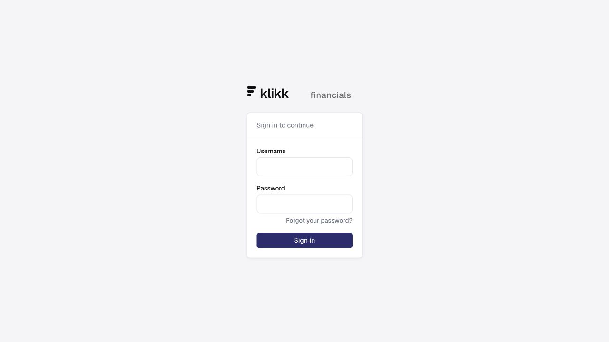

The page is focused, readable, and visually restrained. The recovery link opens a blank-address email draft rather than a real recovery flow. More importantly, authentication against the deployed service returned a server error during this audit, so authenticated live-data verification was not possible.

### 2. Dashboard — clear page, wrong product centre of gravity

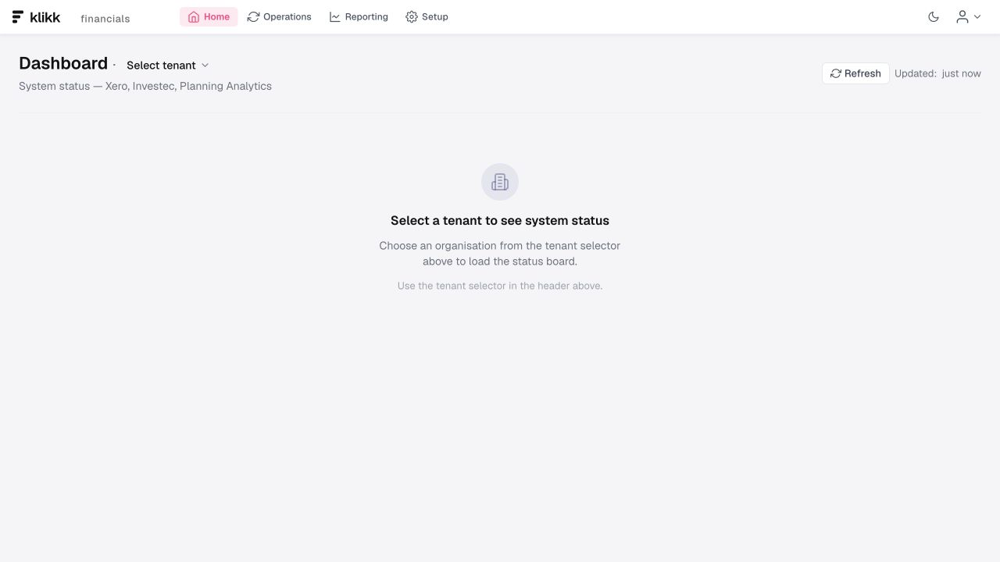

The dashboard is effectively a systems-status screen for Xero, Investec, Planning Analytics, and APIs. A company finance dashboard should lead with company and period context, cash, working capital, P&L/balance-sheet movement, close progress, audit readiness, and the exceptions requiring action.

The company selector is page-local and visually secondary. Company, financial year, and period should be persistent shell-level context.

### 3. Operations — capable, but connector-led and crowded

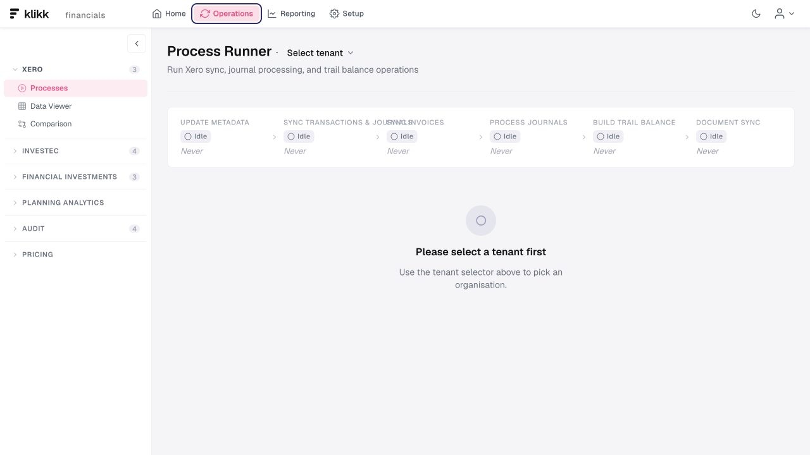

The process-runner pattern is useful, but the stage strip compresses and collides at a normal 1280px desktop width. The surrounding navigation exposes source systems and feature families, making users translate their job into Klikk's technical architecture.

Keep connector health and sync controls, but place them under Setup/Connections. Put the finance work queue and close status at the centre of Operations.

### 4. Audit procedures — strong control design; not yet an operational workspace

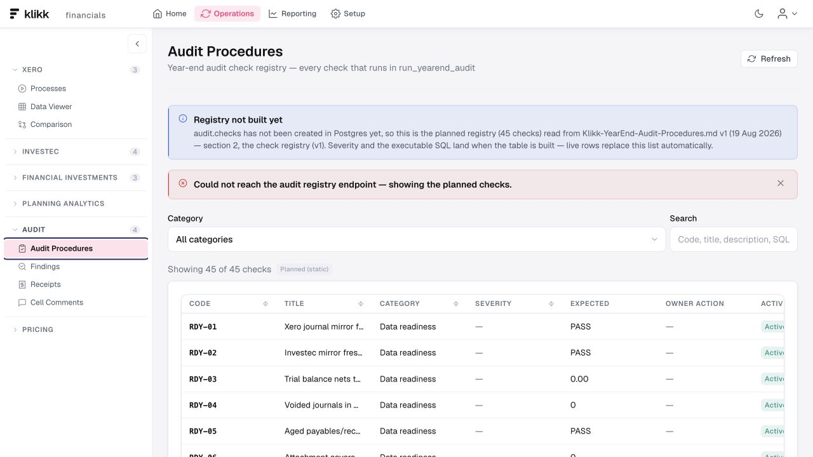

The 45 planned checks cover a valuable range: data readiness, document completeness, bank-to-books, supplier integrity, balance-sheet lifecycle, allocation/tax, and process/intake controls. This is the strongest year-end foundation in the product.

The screen explicitly falls back to planned static checks because the registry endpoint is unavailable, severity cells are incomplete, and there is no visible Run audit action. The current MCP client advertises a `run_yearend_audit` operation, but the checked-out backend contains no matching `/audit/*` implementation that I could locate. The automation contract is therefore fragmented across layers.

The target state should include:

- entity, financial year, data cutoff, and scope selection;
- prerequisite readiness gates before a run starts;
- immutable run history with source snapshot and check-version metadata;
- results grouped into owner actions;
- rerun and before/after resolution comparison.

### 5. Findings — useful register; missing the surrounding close process

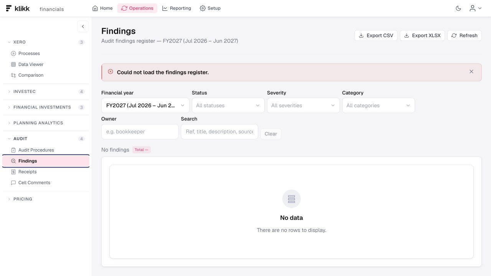

The filterable register is a sound component, but it lacks an executive readiness summary, workload by owner, ageing, due dates, approval state, and a direct trace from check to source transaction, evidence, reviewer, and sign-off.

Use one shared work-item model for audit findings, receipt/document gaps, reconciliation breaks, and cell comments. Every item should carry entity, period, source, severity, owner, due date, status, evidence, linked financial figure, reviewer, and resolution history.

### 6. Receipts — powerful but cognitively dense

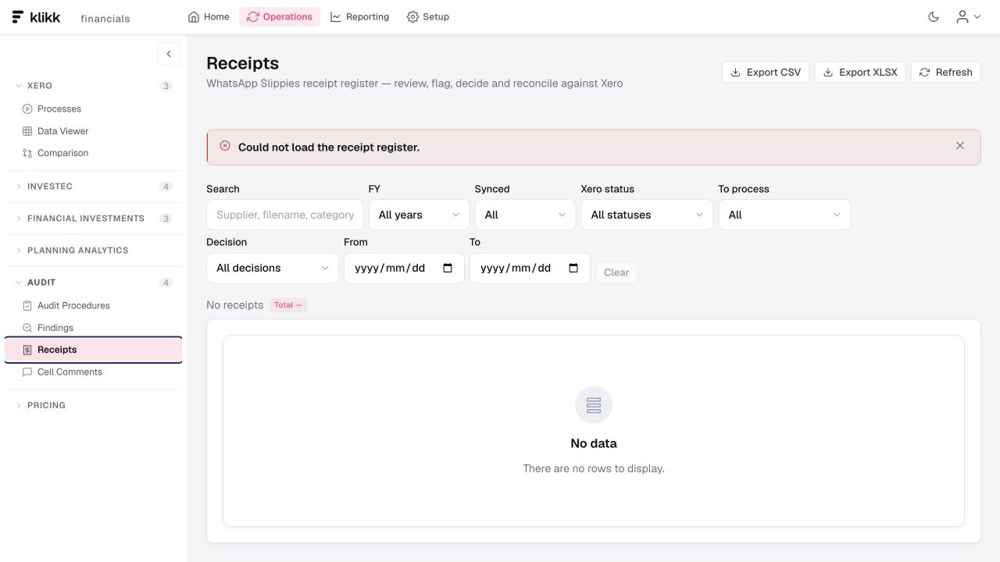

Eight filters appear before the user sees a result. Keep the most common search, state, and period controls visible; move specialist filters into an expandable panel and support saved views. The high-volume receipt path also has the only failing automated test observed in the portal: the 200-row select-all scenario timed out.

### 7. Cell comments — promising evidence bridge; currently isolated

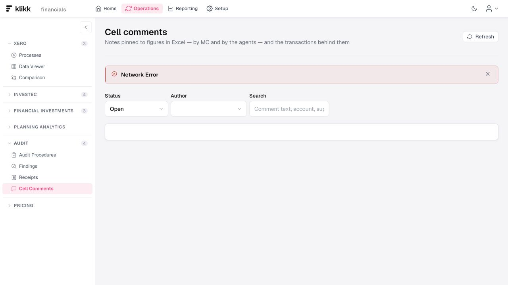

Linking spreadsheet figures, agent comments, and underlying transactions is a differentiated and valuable idea. It should become part of the same evidence and resolution chain as audit findings, rather than another independent register.

### 8. Reporting — coherent styling; duplicated hierarchy and inert-looking controls

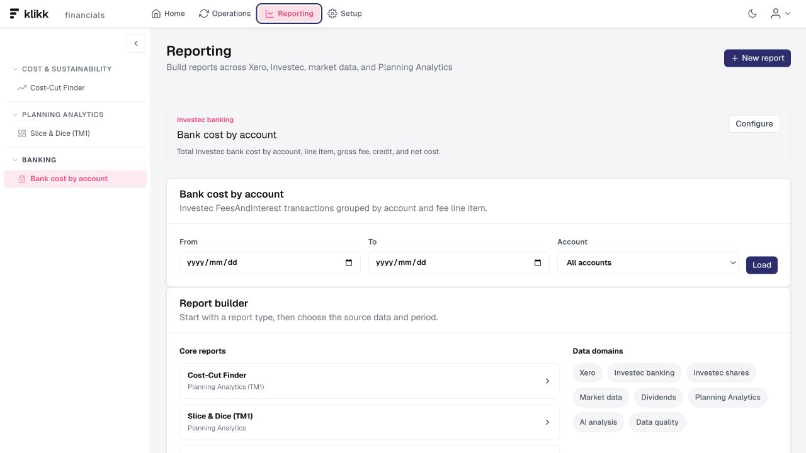

The selected report title is repeated in both the chooser and the report section. The report catalogue remains expanded while the report is open, which makes selection and use feel like one long page rather than distinct modes. The visible New report and Configure buttons do not have handlers in the reviewed component, so the UI promises actions it does not perform.

Use a compact report switcher, separate View and Build modes, and make permissions/availability explicit. If report authoring is not ready, remove or clearly label those controls.

### 9. Mobile reporting — fails responsive reflow

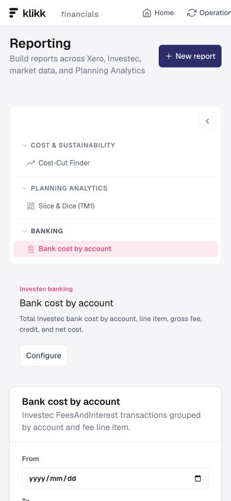

At 390px, the primary navigation is cut off after Operations, with no menu or overflow affordance. The report catalogue becomes a tall full-width card above the selected report, producing excessive scrolling and duplicated hierarchy. This is both a usability and accessibility issue.

### 10. Command palette — good pattern; incomplete product map

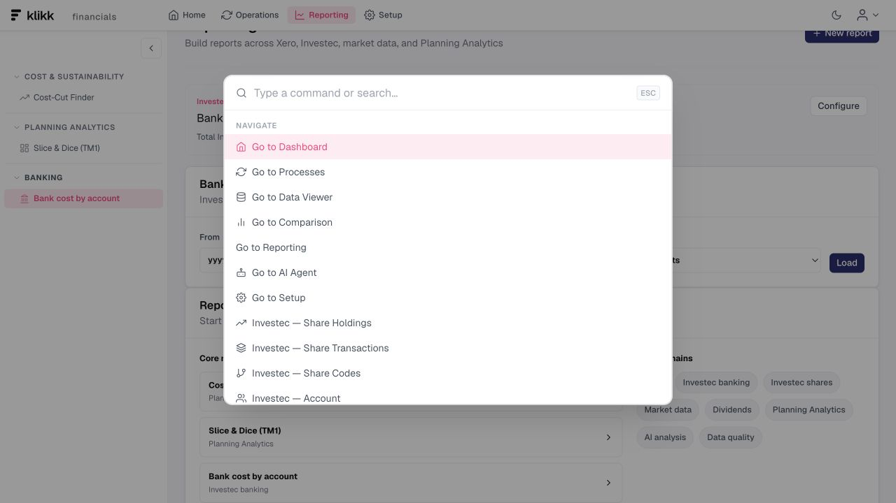

Keyboard navigation is a strong power-user affordance, but the command list omits audit pages, receipt and evidence work, financial-investment subareas, planning analytics, and pricing. It currently drifts from the route tree and cannot compensate for the fragmented navigation.

Generate commands from the same typed navigation model used by the sidebar, with permission-aware destinations and finance-job terminology.

### 11. Component system — a healthy foundation

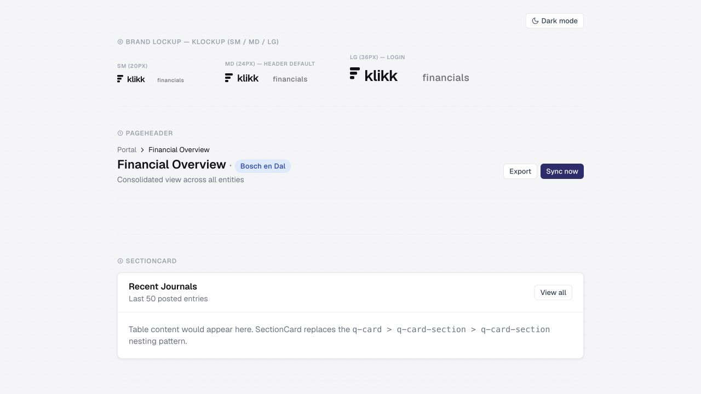

Buttons, inputs, cards, tabs, tables, alerts, status pills, and typography are consistently executed. Preserve this language. The redesign should focus on workflow, hierarchy, responsive behaviour, and states rather than a cosmetic reset.

## Recommended product structure

1. **Overview** — company/period context, cash and performance KPIs, close readiness, audit blockers, and one work queue.
2. **Money** — bank, transactions, reconciliation, receivables/payables, and receipt/document matching.
3. **Close** — monthly/year-end checklist, dependencies, owners, due dates, reconciliations, journals, and approvals.
4. **Reporting & planning** — reviewed reports, planning, variance analysis, and export.
5. **Audit** — Readiness → Run → Findings → Evidence → Review/sign-off → Audit pack.
6. **Setup & connections** — Xero, Investec, TM1/Planning Analytics, AI/agents, company configuration, roles, and policies.

Financial investments and pricing should either sit inside a clearly optional domain workspace or remain separate products if they do not share the same company close and control model.

## Year-end automation blueprint

The seamless path should be:

`Company + FY → data readiness → close checklist → automated controls → unified exceptions → evidence requests → reviewer sign-off → frozen audit pack → rerun/delta`

A complete audit pack should preserve:

- run ID, timestamp, entity, FY, period, data cutoff, source snapshot, and check versions;
- trial balance and financial-statement extracts tied to the same snapshot;
- reconciliations, journals, supporting documents, and linked source transactions;
- every exception's owner, severity, resolution, reviewer, and approval history;
- outstanding limitations and signed management representations;
- an indexed, exportable pack with stable evidence links and a tamper-evident manifest.

Avoid a single opaque readiness percentage. Show explicit gates such as Data current, Balances reconciled, Documents complete, Findings cleared, and Approvals complete, with blocker counts and owners.

## Priority plan

### P0 — restore a trustworthy operating baseline

- Fix deployed authentication/availability and the local backend startup/import break.
- Align the portal, MCP contract, and backend implementation for every `/audit/*` endpoint.
- Make the complete automated test suite green, including the 200-row receipt scenario.
- Remove or disable visible controls without implemented actions.

### P1 — build the close-to-audit spine

- Add persistent company, financial-year, and period context.
- Create the Audit Run workspace and immutable run history.
- Unify findings, receipt gaps, reconciliation breaks, and comments into one work queue.
- Add ownership, due dates, approvals, review, evidence, and resolution lineage.
- Generate the signed, frozen audit pack from the same run.

### P2 — tighten information architecture and interaction design

- Replace connector-led top-level navigation with finance jobs.
- Make the header and secondary navigation responsive.
- Simplify report selection versus report-building modes.
- Use progressive disclosure and saved views for dense filters.
- Generate sidebar and command-palette destinations from one source.

### P3 — harden governance

- Add explicit finance roles and maker-checker approval UX.
- Preserve immutable audit logs and evidence versions.
- Add retention, access, lock/reopen, and controlled override policies.
- Surface control failures and integration freshness at company and period level.

## Accessibility notes

Strengths observed: semantic headings and navigation, labelled controls, alert/status roles, keyboard command palette behaviour, non-colour-only status treatments, and reduced-motion support.

Confirmed issues:

- the desktop navigation does not reflow at a 390px viewport;
- audit and reporting tables can clip horizontally without a prominent affordance;
- `KTablePagination.vue` renders a literal `Page {{ pageIndex + 1 }} of {{ pageCount }}` accessibility label instead of binding the expression;
- dense filter-first pages create a high cognitive and keyboard-navigation burden.

This was not a complete WCAG audit. Screen-reader flows, zoom beyond the captured mobile viewport, contrast measurement, focus order across every route, and error recovery with real data remain unverified.

## Engineering evidence

- Production build: passed, with Sass import and bundling warnings.
- Lint: passed, with one unused-variable warning in a test.
- Tests: 897 passed, one expected failure, one failure in the 200-row audit-receipts scenario.
- Portal size: 28 page components, 59 shared components, 34 registered route paths, approximately 46,814 Vue lines.
- Several feature pages exceed 1,000 lines; `PivotExplorer.vue` is approximately 3,835 lines and `FinancialInvestments.vue` approximately 2,685. Breaking these into workflow-level containers, domain services, and reusable state modules will reduce drift.

## Evidence limits

The deployed app's authentication returned a server error, the public site was unreachable during the audit, and the checked-out backend could not start because of an existing in-progress import mismatch. I therefore reviewed the live login, local route shells, source code, API/MCP contracts, responsive states, and automated checks without accessing or changing real financial data.

Backend authorization enforcement, data accuracy against production ledgers, security controls, real audit-pack exports, end-to-end integrations, and actual year-end performance were not verified. These limitations are operational findings, but any conclusion about production data integrity would require a working authenticated environment and representative company data.
