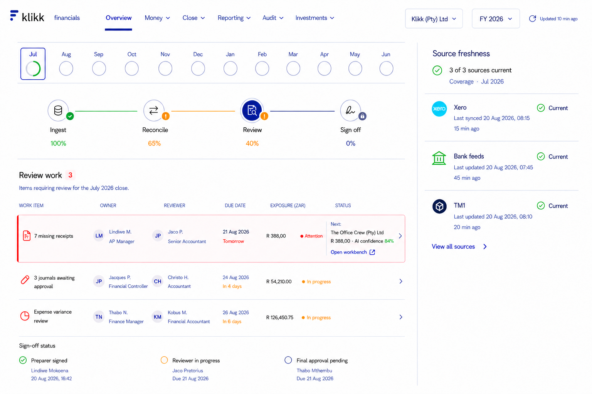
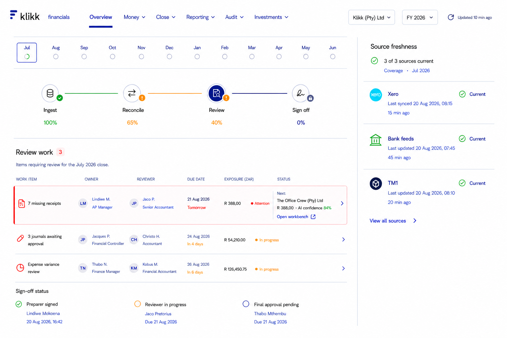

# Close Overview Token and Spacing Audit

## Audit scope

Single-screen visual conformance audit of the approved Close Overview wireframe at 1536 × 1024. The audit compares the screen against the canonical tokens in `src/css/klikk.css` and the Klikk design-language reference.

## User goal and accessibility target

Keep the month-led close workflow compact, consistent and easy to scan while preserving clear status, source freshness and financial work-item hierarchy. Visible controls should have adequate target size and status must not rely on colour alone.

## Evidence

### 1. Before conformance pass

### 2. Token-conformant revision

## Canonical baseline

- Spacing: 4px base with 8, 12, 16, 20, 24 and 32px working steps.
- Type: 12px captions/table headers, 13px supporting text, 14px body/navigation, 16px section headings.
- Controls: 32px compact and 40px standard desktop controls; 44px minimum interactive target where appropriate.
- Borders: 1px; radii: 6, 8 and 12px.
- Typography: Geist with tabular numerals for finance values.
- Colour roles: navy for selection/primary navigation, pink for focused attention, semantic success/warning/danger/info for status.

## Strengths retained

- Month navigation, close stages, work queue and source freshness follow one clear top-to-bottom workflow.
- Company and financial year remain persistently visible.
- Source status pairs colour with icons and the text `Current`.
- Amounts, dates, owners and review state remain aligned in a stable finance-table grid.
- The source rail has compact rows and enough vertical capacity for more sources.

## Findings and corrections

1. **Month progress controls were oversized.** The 36–40px circles visually competed with close-stage controls and no longer matched the original compact month strip. Corrected to 16px progress outlines with an empty white centre and a compact selected-month tile.
2. **Vertical rhythm was loose.** Month, stage and work sections used inconsistent open space. Corrected to a 24–32px section rhythm based on the 4px grid.
3. **Control proportions drifted.** Header selectors were visually taller than the standard desktop control token. Tightened toward the 40px control size with 8px radii.
4. **Text hierarchy overused navy.** Ordinary metadata competed with navigation and active state. Corrected toward primary, secondary and muted neutral text roles; navy remains for selected navigation, links and the active Review stage.
5. **Status colours were inconsistent.** Success, warning and attention accents were normalised toward the semantic token roles while retaining text/icon reinforcement.
6. **Source rows needed a shared internal grid.** Icons, source names, timestamps, age and status are now aligned with consistent compact padding and separators.
7. **Finance rows needed predictable density.** Regular rows use a shared compact rhythm; only the selected receipt row remains taller because it contains the next action and evidence summary.

## Accessibility risks and verification gaps

- The screenshot supports a visual hierarchy review only. Keyboard order, focus restoration, semantic headings, table markup, screen-reader output, 200% zoom and responsive reflow still require implementation testing.
- The month progress ring needs an accessible text equivalent such as `July close, 72% complete`; the visual ring alone is not sufficient.
- All month items and stage controls should expose at least a 44px interaction target even though the visible progress rings are intentionally 16px.
- Final colour contrast must be measured from implemented token values, not inferred from the raster mockup.

## Implementation guidance

- Consume `--kdl-*` variables rather than copying raster colours or hardcoding values.
- Reuse the existing `MonthCoverageStrip`, table and status primitives where possible.
- Keep visible month rings small while making the complete month item the interactive control.
- Validate the implemented screen at desktop, 200% zoom and keyboard-only navigation before release.
