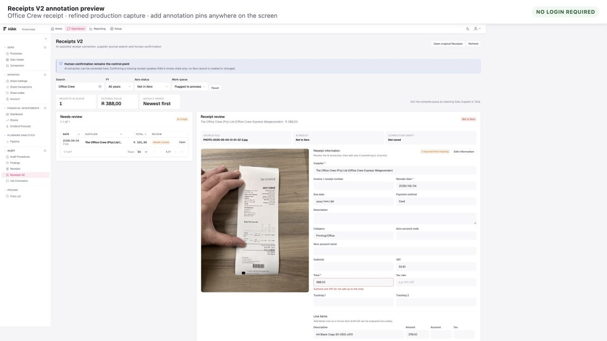
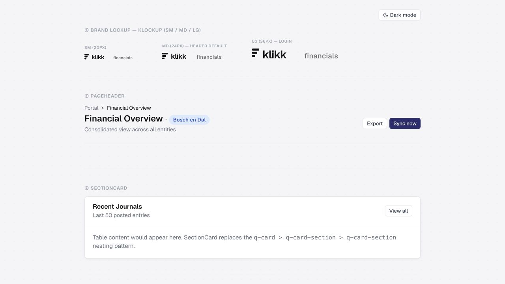

# Code and product audit

Date: 20 August 2026  
Scope: portal `main`, backend production `origin/main`, current Receipts V2 preview and current component preview.

## Verdict

Klikk has a strong component foundation and an unusually valuable accounting/audit domain model, but it currently behaves like a collection of powerful specialist tools. The main work is not another reskin. It is to establish a finance operating spine, reduce oversized containers, unify navigation and state, and make evidence/approval part of every exception workflow.

## Evidence captured in this run

Receipts V2 demonstrates the right direction: work queue on the left, source document and correction data together, clear human-confirmation language and supplier-journal search. It also exposes the next UX problem: at a normal desktop size the screen is dense, key actions sit far from the decision fields and the supplier-history area is below the captured fold.

The shared language is calm, readable and appropriate for finance. Tokens, components and semantics are ahead of the product information architecture.

The production login was inspected and confirmed blocked by the known 500, but its screenshot was excluded because the browser retained entered form state. Authenticated live routes could not be captured in this run. The existing broader audit at `docs/audits/2026-08-20-klikk-financials/REPORT.md` remains a useful earlier baseline but is not treated as new screenshot evidence here.

## Engineering strengths

- 62 shared Vue components, including a meaningful finance-specific primitive layer.
- 64 frontend test files and policy tests for tables, accessibility, receipts and responsive behaviour.
- Production backend has a default-authentication lockdown and dedicated regression coverage.
- Xero pipeline models source, metadata, transaction, cube, validation and sync concerns separately.
- Audit and receipt workflows preserve evidence without silently writing to Xero.
- Price history uses effective dates and database constraints.
- The Excel add-in documents its least-privilege and credential-storage invariants.

## Structural risks

### 1. Repository drift

The ordinary backend working copy was 46+ commits behind production and on a deleted feature branch. It omitted four live apps. This can make an apparently correct change impossible to deploy or cause architecture documentation to describe the wrong system.

### 2. Oversized modules

Frontend examples: `PivotExplorer.vue` 3,835 lines, `FinancialInvestments.vue` 2,685, `SetEditor.vue` 1,658, `AuditFindings.vue` 1,511 and `AiAgent.vue` 1,471.

Backend examples: `investec/views.py` 2,436 lines, `ai_agent/views.py` 1,872, `xero_core/services.py` 1,403, `xero_data/transaction_processor.py` 1,358 and `xero_data/views.py` 1,033.

These modules mix transport, orchestration, domain rules, serialization and presentation. They are difficult to test in isolation and invite styling/API drift.

### 3. Connector-led information architecture

Users must choose Xero, Investec or Planning Analytics before choosing the finance task. A financial manager thinks in cash, payables, close, reporting and audit readiness. The current architecture leaks the integration topology into the navigation.

### 4. Fragmented work items

Audit findings, receipt gaps, reconciliation breaks and cell comments have different registers and state models. The year-end experience therefore has no single owner queue, due-date view, ageing view or sign-off state.

### 5. Context is not global enough

Tenant is persistent, but company/FY/period/cutoff are not one explicit shell contract. Screens infer time differently and audit/reporting actions can drift from the period the user believes they are reviewing.

### 6. Authentication model is transitional

Portal JWT, Excel DRF token and MCP service token are legitimate separate credential types, but service identities are represented inconsistently. Duplicate email data exposed an unhandled assumption. The long-term answer is scoped service credentials, not sharing the super-admin identity.

### 7. Documentation drift

Security and receipts documentation still contain statements that were true before the 20 August lockdown. Knowledge should be generated from or checked against current routes, permissions and model constraints.

## UX and accessibility risks

- Dense filter-first screens make the primary decision hard to find.
- Mobile navigation and wide analytical tables need deliberate reflow/overflow patterns.
- Pagination announces a template literal rather than the computed page label.
- Some command-palette destinations drift from the route tree.
- The login error copy exposes transport detail instead of a recoverable instruction.
- Draft AI corrections do not yet have a consistent field-level confidence and source-evidence treatment.

Screenshot review cannot establish full WCAG compliance. Keyboard order, screen-reader output, focus restoration, zoom/reflow and contrast measurements still require targeted testing after authentication is restored.

## Priorities

### P0 — trustworthy baseline

- finish and release the login fix;
- standardise the production branch/worktree workflow;
- keep the auth lockdown regression suite green;
- fix pagination labelling and remove controls without implemented actions.

### P1 — finance operating spine

- persistent company/FY/period context;
- close checklist and readiness gates;
- unified work item/evidence model;
- immutable audit runs, approvals and audit packs.

### P2 — modularity and navigation

- domain-oriented route/navigation registry;
- feature modules with composables/repositories/types;
- split the five largest frontend and backend containers at workflow boundaries;
- consolidate design aliases and raw controls.

### P3 — governance and scale

- named scoped service credentials;
- company membership and finance roles;
- maker/checker approval rules;
- retention, lock/reopen and tamper-evident evidence policies.
