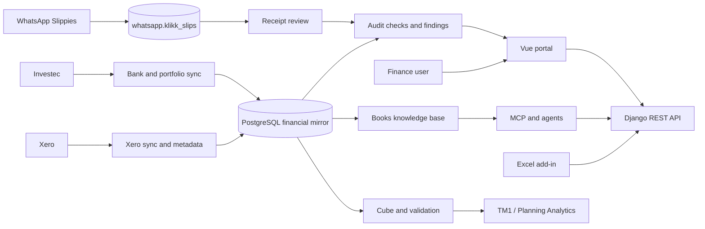

# System architecture

## Runtime map

## Frontend structure

- `src/router/routes.js`: route tree.
- `src/layouts`: global, operations and setup shells.
- `src/pages`: route containers. Several also contain data access, state, transformation and extensive scoped CSS.
- `src/components/klikk`: reusable design primitives.
- `src/components/<domain>`: reporting, findings, receipts and data-viewer components.
- `src/api`: Axios client and domain API wrappers.
- `src/stores`: authentication, tenant/data and process state.
- `src/css/klikk.css`: canonical Klikk Design Language tokens and shared classes.

The main architectural weakness is that feature pages own too many layers at once. The target is `domain route → feature shell → composables/state → API repository → shared UI`, with types and navigation metadata shared instead of repeated.

## Backend structure

Production `origin/main` contains 12 Django apps and roughly 95 model classes:

- `user`: interactive and service authentication.
- `xero/*`: auth, core API client/quota, metadata, data, sync, cubes, validation, integration and webhooks.
- `receipts`: review state over the external WhatsApp receipt register.
- `audit`: check registry, runs, results, findings and evidence graph.
- `kb`: read-only books doctrine over PostgreSQL schema `kb`.
- `investec`: banking, investments, beneficiaries and cash flow.
- `financial_investments`: external market data and dividend workflows.
- `planning_analytics`: TM1 configuration, execution and analytical APIs.
- `personal_expenses`: rule-based classification and reporting.
- `pricelist`: effective-dated rate card and quote calculation.
- `ai_agent`: conversational agent, tools, RAG, sessions and monitoring.
- `deployment`: deployment support; public webhook routing has been removed from the current security baseline.

## Data ownership rules

- Xero remains the accounting source of truth. Local tables mirror and analyse it.
- Receipt review never mutates `whatsapp.klikk_slips`; it stores loose-keyed review/comment rows.
- Receipts V2 must not create a Xero bill without explicit review, idempotency and an evidence link.
- Price-list writes affect local price tables only.
- Audit checks are versioned, deterministic procedures. AI may explain results but may not silently rewrite evidence or outcomes.
- Excel uses its own least-privilege identity; the portal user's JWT is not embedded in workbooks.

## Authentication boundary

Production now defaults DRF to `IsAuthenticated`; public exceptions are credential bootstrap, the Xero OAuth callback and HMAC-signed file viewers. This lockdown is newer than several feature documents and must not be regressed.

Recommended end state:

- one human user model with roles and company membership;
- named service credentials as a separate model with scopes, expiry, last-used time and revocation;
- short-lived JWT for browsers;
- scoped token for Excel and MCP, never a superuser-equivalent shared secret;
- explicit maker/checker permissions for financial writes and audit sign-off.

## Deployment

The production VM runs PostgreSQL plus containers for the Django backend, Vue/nginx console, WhatsApp bridge/sync and MCP. Public traffic reaches the console and forwards `/backend/*` to Django. The frontend is built with `VITE_API_BASE_URL=/backend`.

Deployment pulls Git repositories on the VM and rebuilds Docker Compose. Production rollout, database changes, token rotation and account deletion remain explicit approval points.
