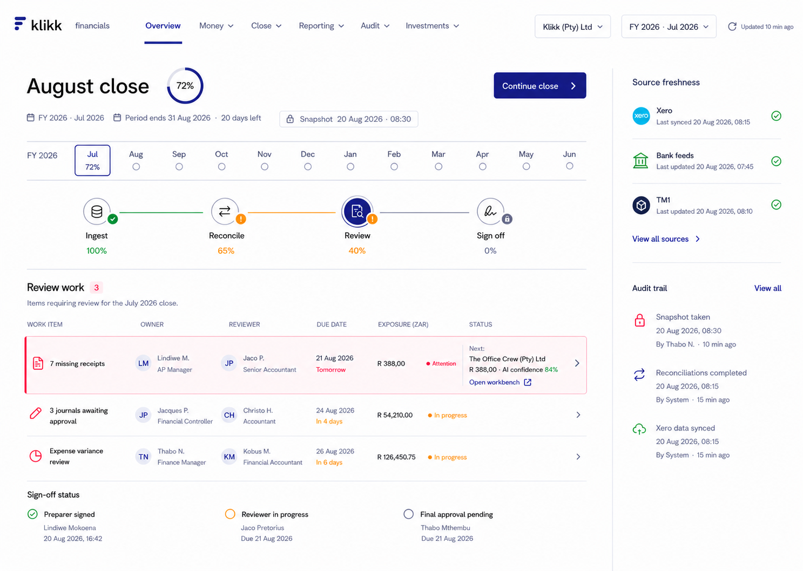
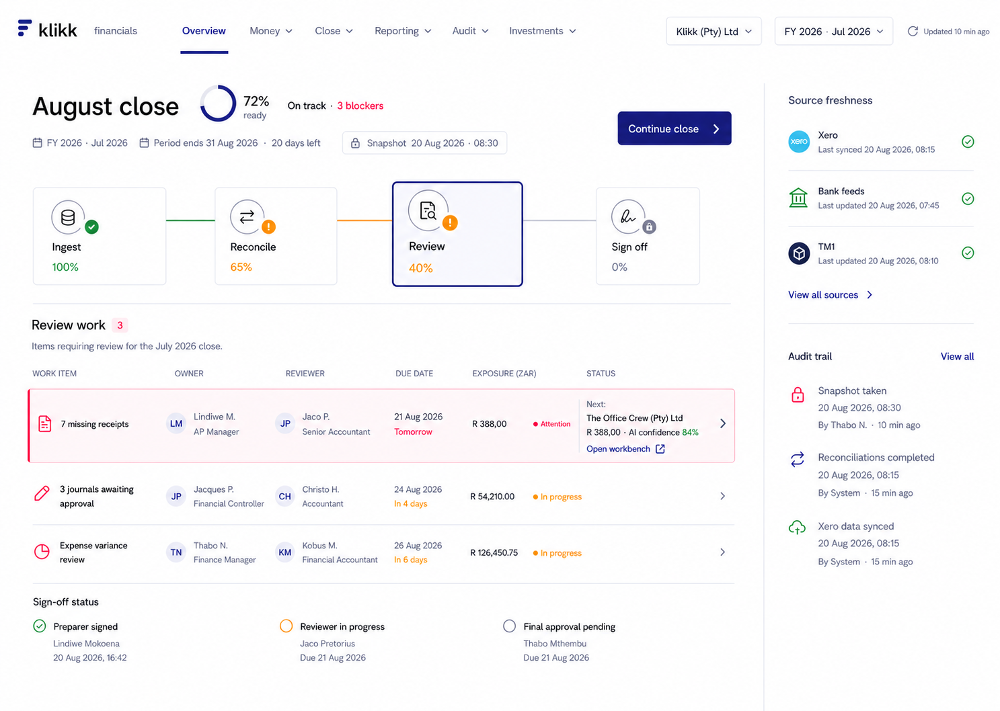
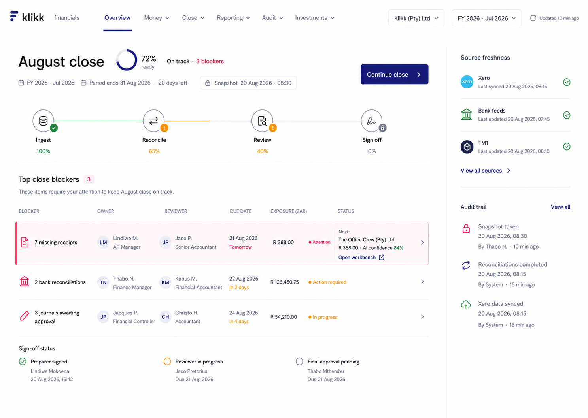
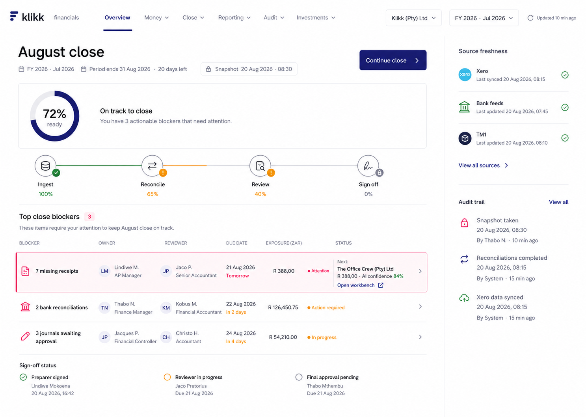
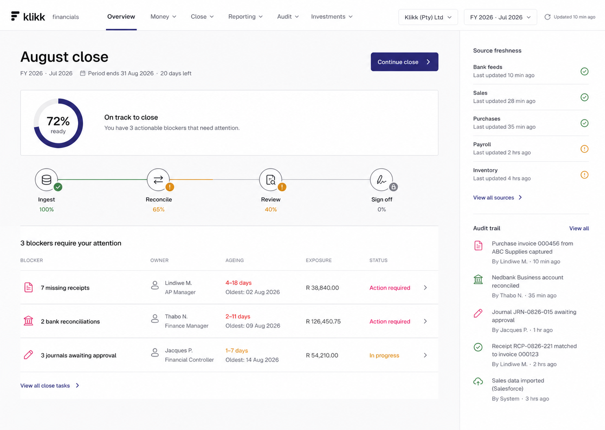
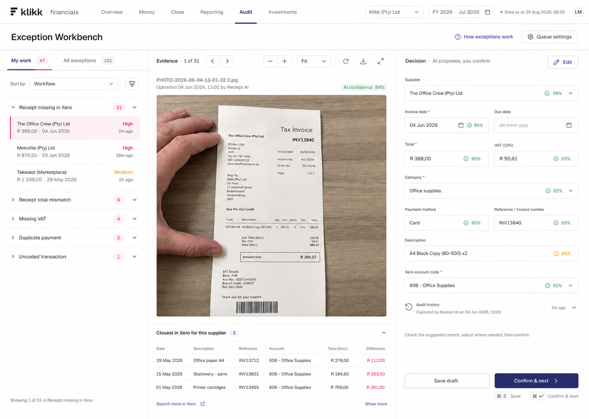
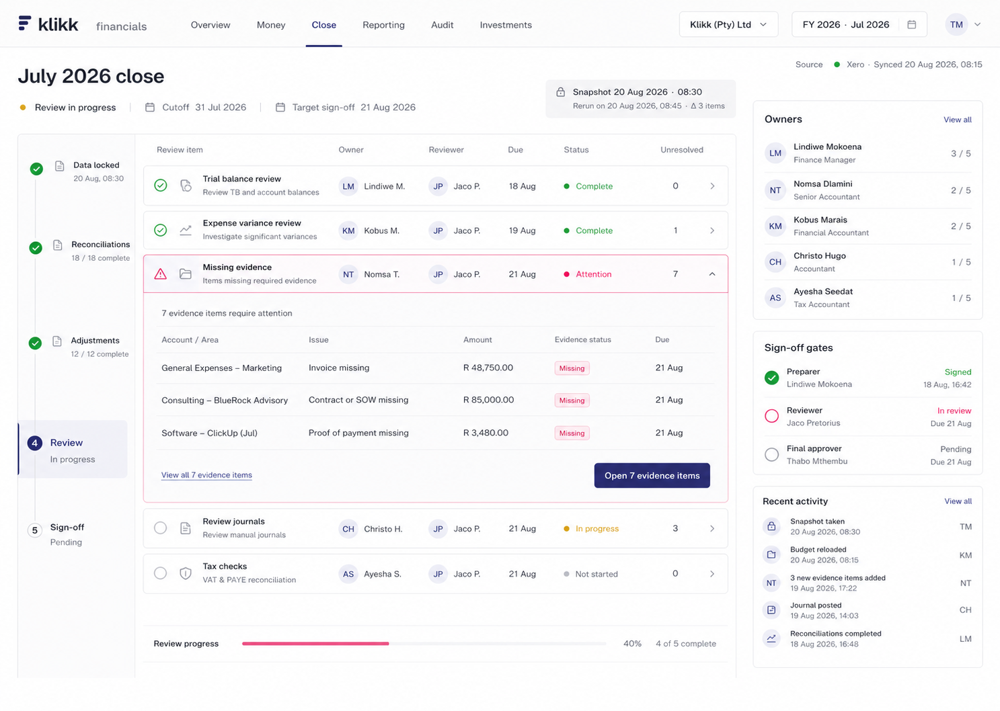

# Wireframe directions

These are visual architecture explorations, not implemented screens. All three use the existing Klikk Design Language and the same target information architecture. The selected image must be confirmed before image-to-code implementation begins.

## Latest revision: Month Overview + Icon Stages

The close header is now one compact action row: title, progress ring containing `72%`, and the primary action. The fiscal-year strip exposes all twelve periods from July through June. Large stage cards are removed; each stage icon is the button and `Review` shows the selected state.

Month interaction contract:

- Month order follows the tenant's configured fiscal-year start; Klikk currently begins in July.
- Selecting a month changes the period context for readiness, stages, work items, freshness snapshot and sign-off status.
- The month control shows closed/current/upcoming state with text or an icon, not colour alone.
- Changing month is read-only and must warn before abandoning any unsaved correction draft.

## Latest revision: Interactive Close Stages

The four close stages are now one accessible selector controlling the work register below it. The static frame shows `Review` selected; switching stages changes the register without changing company, period or snapshot context.

Interaction contract:

- `Ingest` focuses source imports, freshness, validation and failed pipeline work.
- `Reconcile` focuses bank, control-account and balance reconciliation work.
- `Review` focuses receipts, journals, variances and evidence requiring human review.
- `Sign off` focuses preparer, reviewer and final-approver gates.
- Switching stages is read-only. It changes the register view and must never run a process, approve an item, post to Xero or lock a period.
- Use tab semantics with one selected stage, visible keyboard focus, arrow-key navigation and a minimum 44px target.

## Latest revision: Compact Readiness Close Hub

The 72% readiness signal is now a compact header indicator. The close-stage progression and blocker queue move substantially higher, preserving more of the working surface above the fold.

## Feedback revision: Calm Close Hub

This revision combines the calm readiness hierarchy of Close Control Tower with a lightweight entry into the focused Exception Workbench. It retains snapshot and sign-off governance from Period Command Centre without its phase rail, expanded checklist, owner panel or activity density.

## Close Control Tower

Emphasis: period readiness, stage progression, material blockers and source freshness.

## Exception Workbench

Emphasis: high-throughput evidence review, field-level correction, supplier history and human confirmation.

## Period Command Centre

Emphasis: governed close checklist, ownership, maker/checker review, locked snapshots and sign-off gates.
